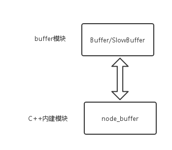

## Buffer介绍
> 在 [ECMAScript 2015] (ES6) 引入 TypedArray 之前，JavaScript 语言没有读取或操作二进制数据流的机制。 Buffer 类被引入作为 Node.js API 的一部分，使其可以在 TCP 流或文件系统操作等场景中处理二进制数据流。

> TypedArray 现已被添加进 ES6 中，Buffer 类以一种更优化、更适合 Node.js 用例的方式实现了 Uint8Array API。

> Buffer 类的实例类似于整数数组，但 Buffer 的大小是固定的、且在 V8 堆外分配物理内存。 Buffer 的大小在被创建时确定，且无法调整。

> Buffer 类在 Node.js 中是一个全局变量，因此无需使用 require('buffer').Buffer。

(摘自[Nodejs中文API](http://nodejs.cn/api/buffer.html))

虽然全文基于[color=#ec7379]《Nodejs深入浅出》[/color]，但是因为有段年头有些API已经是被废弃的，所以这里的demo都是以Nodejs10为准。


## ~~new Buffer()~~
在 Node.js v6 之前的版本中，Buffer 实例是通过 Buffer 构造函数创建的，它根据提供的参数返回不同的 Buffer。

在 [color=#ec7379]Node.js 8.0.0[/color] 之前，分配给这种 Buffer 实例的内存是没有初始化的，且可能包含敏感数据。 这种 Buffer 实例随后必须被初始化，可以使用 buf.fill(0) 或写满这个 Buffer。 虽然这种行为是为了提高性能而有意为之的，但开发经验表明，创建一个快速但未初始化的 Buffer 与创建一个慢点但更安全的 Buffer 之间需要有更明确的区分。从 [color=#ec7379]Node.js 8.0.0[/color] 开始， Buffer(num) 和 new Buffer(num) 将返回一个初始化内存之后的 Buffer。因为 new Buffer() 的行为会根据所传入的第一个参数的值的数据类型而明显地改变，所以如果应用程序没有正确地校验传给 new Buffer() 的参数、或未能正确地初始化新分配的 Buffer 的内容，就有可能在无意中为他们的代码引入安全性与可靠性问题。

为了使 Buffer 实例的创建更可靠、更不容易出错，各种 new Buffer() 构造函数已被 废弃，并由 [color=#ec7379]Buffer.from()、Buffer.alloc()、和 Buffer.allocUnsafe() [/color]方法替代。

总的来说废弃原因有：
1，内存没有初始化且可能包含敏感数据；
2，引入安全性与可靠性问题；


## 类方法：Buffer.from()
使用入参较为品类众多。

### Buffer.from(array)
返回一个新建的包含所提供的字节数组的副本的 Buffer。

```
// 创建一个新的包含字符串 'buffer' 的 UTF-8 字节的 Buffer
const buf = Buffer.from([0x62, 0x75, 0x66, 0x66, 0x65, 0x72]);
console.log(buf.toString());//buffer
```

---

### Buffer.from(arrayBuffer[, byteOffset[, length]])

|参数|描述|
|-|-|
|arrayBuffer  [ArrayBuffer，SharedArrayBuffer] | ArrayBuffer 或 SharedArrayBuffer 或 TypedArray 的 .buffer 属性|
|byteOffset [integer] | 开始拷贝的索引。默认为 0 |
|length [integer] |拷贝的字节数。默认为 arrayBuffer.length - byteOffset |

该方法将创建一个 ArrayBuffer 的视图，而**不会复制底层内存**。
例如，当传入一个 TypedArray 实例的 .buffer 属性的引用时，这个新建的 Buffer 会像 TypedArray 那样共享同一分配的内存。

```
const arr = new Uint16Array(2);

arr[0] = 5000;
arr[1] = 4000;

// 与 `arr` 共享内存
const buf = Buffer.from(arr.buffer);

// 输出: <Buffer 88 13 a0 0f>
console.log('buf：', buf);

// 改变原始的 Uint16Array 也会改变 Buffer
arr[1] = 6000;

// 输出: <Buffer 88 13 70 17>
console.log('修改arr后：', buf);
```

---

### Buffer.from(buffer)
复制传入的 Buffer 实例的数据，并返回一个新的 Buffer 实例。

```
const buf1 = Buffer.from('buffer'),
    buf2 = Buffer.from(buf1);

buf1[0] = 0x61;

console.log('buf1： ', buf1.toString());
console.log('buf2： ', buf2.toString());

// buf1：  auffer
// buf2：  buffer
```

---

### Buffer.from(string[, encoding])

|参数|描述|
|-|-|
|string | 编码字符串|
|encoding [string] | string 的字符编码。 默认: 'utf8' |

返回一个被 string 的值初始化的新的 Buffer 实例。

```
const buf1 = Buffer.from('this is a tést');

// 输出: this is a tést
console.log(buf1.toString());

// 输出: this is a tC)st
console.log(buf1.toString('ascii'));


const buf2 = Buffer.from('7468697320697320612074c3a97374', 'hex');

// 输出: this is a tést
console.log(buf2.toString());

```


### 类方法：Buffer.alloc(size[, fill[, encoding]])
|参数|描述|
|-|-|
|size [integer] | Buffer长度|
|fill [string，Buffer，integer] | 预填充值，默认：0 |
|encoding [string]|如果 fill 是字符串，则该值是它的字符编码。 默认：'utf8' |

分配一个大小为 size 字节的新建的 Buffer，后期也可以通过Buffer对象的toString()转换编码。

注意：
1，8.2.0新增[color=#ec7379]buffer.constants[/color]模块属性，里面有个[color=#ec7379]buffer.constants.MAX_LENGTH[/color]属性，意思是单个Buffer实例允许的最大量度，在32位体系结构上，这个值是(2^30)-1 (~1GB)。 在64位体系结构上，这个值是(2^31)-1 (~2GB)，也可在buffer.kMaxLength查看该值。
2，现代浏览器遵循 WHATWG 编码标准 将 'latin1' 和 ISO-8859-1 别名为 win-1252。 这意味着当进行例如 http.get() 这样的操作时，如果返回的字符编码是 WHATWG 规范列表中的，则有可能服务器真的返回 win-1252 编码的数据，此时使用 'latin1' 字符编码可能会错误地解码数据。

如果 size 大于 buffer.constants.MAX_LENGTH 或小于 0，则抛出 [RangeError] 错误。
```
const buf = Buffer.alloc(-1);
// buffer.js:269
//     throw err;
//     ^
//
// RangeError [ERR_INVALID_OPT_VALUE]: The value "-1" is invalid for option "size"
```


### 类方法：Buffer.allocUnsafe(size)
和Buffer.alloc()的区别除了没有可选项之外（可以使用fill()填充），以这种方式创建的 Buffer 实例的底层内存是未初始化的。 新创建的 Buffer 的内容是未知的，且可能包含敏感数据。而size的注意事项和Buffer.alloc()一样。

Buffer 模块会预分配一个大小为 [color=#ec7379]Buffer.poolSize[/color]（默认：[color=#ec7379]8192[/color]，用于决定预分配的、内部 Buffer 实例池的大小的字节数，可修改） 的内部 Buffer 实例作为快速分配池， 用于使用 Buffer.allocUnsafe() 新创建的 Buffer 实例，以及废弃的 new Buffer(size) 构造器， 仅限于当 size 小于或等于 Buffer.poolSize >> 1 （即4096，不清楚的下面会提到）。

对这个预分配的内部内存池的使用，是调用 Buffer.alloc(size, fill) 和 Buffer.allocUnsafe(size).fill(fill) 的关键区别。 具体地说，[bgcolor=#ffe9ec]Buffer.alloc(size, fill) 永远不会使用这个内部的 Buffer 池，但如果 size 小于或等于 Buffer.poolSize 的一半， Buffer.allocUnsafe(size).fill(fill) 会使用这个内部的 Buffer 池[/bgcolor]。 当应用程序需要 Buffer.allocUnsafe() 提供额外的性能时，这个细微的区别是非常重要的。


### >>  和 >>> 计算符
\>>：数值除以2的幂函数后的最大整数值
```
console.log(10000 >> 1);
console.log(10000 >> 2);
console.log(10000 >> 3);
console.log(10000 >> 4);
// 5000
// 2500
// 1250
// 625
```

\>>>：数值减半向下整取
```
console.log(100 >>> 1);
console.log(99.9 >>> 1);
console.log(99 >>> 1);
// 50
// 49
// 49
```


## Buffer.allocUnsafeSlow(size) 替代  ~~SlowBuffer 类~~   
[color=#b1b1b1]（目测用法事项都一个样，可能只是觉得没必要单独弄个类所以把方法并入Buffer类里吧，底层实现有没变就不清楚了）[/color]

分配一个大小为 size 字节的新建的 Buffer 。 如果 size 大于 buffer.constants.MAX_LENGTH（上面说过，不记得回顾一下） 或小于 0，则抛出 [RangeError] 错误。

以这种方式创建的 Buffer 实例的底层内存是未初始化的。 新创建的 Buffer 的内容是未知的，且可能包含敏感数据。 可以使用 buf.fill(0) 初始化 Buffer 实例为0。

当使用 Buffer.allocUnsafe() 分配新建的 Buffer 时，当分配的内存小于 4KB 时，默认会从一个单一的预分配的 Buffer 切割出来。 这使得应用程序可以避免垃圾回收机制因创建太多独立分配的 Buffer 实例而过度使用。 这个方法通过像大多数持久对象一样消除追踪与清理的需求，改善了性能与内存使用。

当然，在开发者可能需要在不确定的时间段从内存池保留一小块内存的情况下，使用 Buffer.allocUnsafeSlow() 创建一个非池的 Buffer 实例然后拷贝出相关的位元是合适的做法。

```
// 需要保留一小块内存块
const store = [];

socket.on('readable', () => {
    const data = socket.read();

    // 为保留的数据分配内存
    const sb = Buffer.allocUnsafeSlow(10);

    // 拷贝数据进新分配的内存
    data.copy(sb, 0, 0, 10);

    store.push(sb);
});
```
[color=#b1b1b1]\(官网搬下来，没跑过这段代码)[/color]

Buffer.allocUnsafeSlow() 应当仅仅作为开发者已经在他们的应用程序中观察到过度的内存保留之后的终极手段使用。


### 对比
| 区别     | from  | alloc | allocUnsafe | allocUnsafeSlow|
| -------- | ---------------------------------- | ----- | ----------- |--|
| 入参类型 | array，arrayBuffer，Buffer，string | size  | size | size|
| 返回  | 返回新建包含所提供入参副本的 Buffer  | 返回指定大小被填满的 Buffer 。 速度较慢但可确保不包含敏感数据。  | 返回指定大小被填满的 Buffer，内存未初始化且可能包含敏感数据 |返回指定大小被填满的 Buffer，内存未初始化且可能包含敏感数据|


### 类方法：Buffer.concat(list[, totalLength])
|参数|描述|
|-|-|
|list [Array] | 要合并的 Buffer 或 Uint8Array 实例的数组|
|totalLength [integer] |合并时 list 中 Buffer 实例的总长度|
返回一个合并了 list 中所有 Buffer 实例的新建的 Buffer 。

* 如果 list 中没有元素、或 totalLength 为 0 ，则返回一个新建的长度为 0 的 Buffer 。

* 如果没有提供 totalLength ，则从 list 中的 Buffer 实例计算得到。 为了计算 totalLength 会导致需要执行额外的循环，所以提供明确的长度会运行更快。

* 如果提供了 totalLength，totalLength 必须是一个正整数。如果从 list 中计算得到的 Buffer 长度超过了 totalLength，则合并的结果将会被截断为 totalLength 的长度。

```
const buf1 = Buffer.alloc(10);
const buf2 = Buffer.alloc(14);
const buf3 = Buffer.alloc(18);
const totalLength = buf1.length + buf2.length + buf3.length;

// 输出: 42
console.log(totalLength);

const bufA = Buffer.concat([buf1, buf2, buf3], totalLength);

// 输出: <Buffer 00 00 00 00 ...>
console.log(bufA);
```

Buffer.concat()封装了小Buffer对象向大Buffer对象的复制过程，源码如下：

```
Buffer.concat = function(list, length) {
    if (!Array.isArray(list)) {
        throw new Error('Usage: Buffer.concat(list, [length])');
    }

    if (list.length === 0) {
        return new Buffer(0);
    } else if (list.length === 1) {
        return list[0];
    }

    if (typeof length !== 'number') {
        length = 0;
        for (var i = 0; i < list.length; i++) {
            var buf = list[i];
            length += buf.length;
        }
    }

    var buffer = new Buffer(length);
    var pos = 0;

    for (var i = 0; i < list.length; i++) {
        var buf = list[i];
        buf.copy(buffer, pos);
        pos += buf.length;
    }

    return buffer;
};

```

# Buffer 結構

## 模塊結構
Buffer是一個典型的Javascript與C++結合的模塊，[bgcolor=#ffe9ec]性能部分用C++實現，非性能部分用Javascript實現[/bgcolor]。因爲屬於核心模塊，所以Nodejs在進程啓動的時候就已經加載好了，所以無需引入直接使用。
上次說過因爲Buffer屬於非V8分配的堆外内存，所以非常適用於大多數場景下的大内存操作。



Nodejs内存有关文章请看[Nodejs内存控制](https://www.qdfuns.com/article/40831/8004b9968520abc963e2f954fffd5d7f.html)

## Buffer對象
Buffer對象類似數組，它的元素為16進制的兩位數，即0~255的數值。
```
console.log(Buffer.from('Buffer對象。'));
// <Buffer 42 75 66 66 65 72 e5 b0 8d e8 b1 a1 e3 80 82>
```
> 十六进制（英文名称：Hexadecimal），是计算机中数据的一种表示方法。同我们日常生活中的表示法不一样。它由0-9，A-F组成，字母不区分大小写。与10进制的对应关系是：0-9对应0-9；A-F对应10-15；N进制的数可以用0~(N-1)的数表示，超过9的用字母A-F。

之所以說Buffer對象和數組很像是因爲它們實例化方式，訪問length長度和下標訪問賦值元素都一樣。
```
const buf = Buffer.alloc(100);
console.log(buf.length);
console.log(buf[0]);
buf[0] = 100;
console.log(buf[0]);

// 100
// 0
// 100
```

[bgcolor=#ffe9ec]注意：如果賦值非整數則捨棄小數，小於 0 會逐次加 256 ，大於 255 則逐次減 256。[/bgcolor]
```
const buf = Buffer.alloc(100);
buf[0] = 100.01;
buf[1] = -100;
buf[2] = 300;
console.log(buf[0], buf[1], buf[2]);
//100 156 44
```


## Buffer内存分配
Buffer對象的内存分配是在Nodejs的C++層面實現内存申請的，因爲處理大量的字節數據不能采用需要多少就向操作系統申請多少的方式，這可能造成大量的内存申請的系統調用，對操作系統有一定壓力。因此[bgcolor=#ffe9ec]Nodejs采用C++層面申請内存，Javascript中分配内存的策略[/bgcolor]。

为了高效使用申请的内存，Nodejs采用了 [color=#ec7379]slab 动态内存管理机制[/color]，简单来说就是一块申请好的固定大小的内存区域，有三种状态：
* full：完全分配
* parital：部分分配
* empty：没有被分配

Nodejs以 [color=#ec7379]8KB[/color] 作为界限区分大小对象，也是每个slab的大小值，在Javascript层面作为单位单元进行内存分配。


### 分配小对象
如果指定大小小于8KBNodejs会按照小对象的方式进行分配，主要使用一个局部变量 [color=#ec7379]allocPool[/color] 作为中间处理对象，处于分配状态的slab单元都指向它。
```
/*设置阈值，初始化变量*/
Buffer.poolSize = 8 * 1024;
var poolSize, poolOffset, allocPool;

------------省略其他代码------------

/* 创建池 */
function createPool() {
    poolSize = Buffer.poolSize;
    allocPool = createUnsafeArrayBuffer(poolSize);
    poolOffset = 0;
}
```

> |--------------------------------------------| 8KB的pool
|
offset：0

当前slab处于empty状态，构造小Buffer对象的时候会去检查allocPool对象，如果allocPool没有被创建将会创建新的slab单元指向它。
同时当前Buffer对象的parent属性指向该slab，并记录下是从这个slab的哪个位置（offset）开始使用，slab对象也会记录自身使用了多少字节，如下。
```
const buf = Buffer.from('Buffer');
console.log(buf.parent);
console.log(buf.offset);

// ArrayBuffer { byteLength: 8192 }
// 136

```

>|||||-------------------------------------------------| 8KB的pool
&nbsp;&nbsp;&nbsp;&nbsp;|
&nbsp;&nbsp;&nbsp;&nbsp;offset：128

这时候的slab状态为partial，当再次创建一个Buffer对象时，构造过程会判断这个slab剩余空间是否足够使用并更新分配状态，如果不够会构建新的slab，原有slab的剩余空间就被浪费了。

例如分别构建1个字节和8192字节
```
Buffer.alloc(1);
//<Buffer 00>剩余8191字节被浪费了
Buffer.alloc(8192);
//<Buffer 00 ... 00>
```
除非slab上的Buffer对象都被释放且可回收，否则即使只有一个字节实际上也可能会占据8KB内存。


### 分配大对象
~~~ 创建超过8KB的Buffer对象将会直接分配一个 SlowBuffer 类对象 作为slab单元而且是被独占。 ~~~
已被废弃的: 使用 [color=#ec7379]Buffer.allocUnsafeSlow()[/color] 代替。
```
// Big buffer, just alloc one
this.parent = Buffer.allocUnsafeSlow(this.length);
this.offset = 0;
```

 ~~~ Buffer对象是Javascript层面的，能够被V8垃圾回收标记，但是内部的parent属性指向的SlowBuffer 类对象却来自Nodejs自身C++中的定义，是C++层面的Buffer对象，所用内存不在V8堆中。 ~~~

###小结
Javascript层面只是提供给使用Buffer对象，真正的内存还是Nodejs的C++层面提供。
分配小Buffer对象是采用slab的机制进行预先申请和事后分配。
分配大Buffer对象是直接由C++层面提供的独享内存。


## Buffer 处理

### 支持编码
|支持的字符编码|描述|
|-|-|
|ascii | 仅支持 7 位 ASCII 数据。如果设置去掉高位的话，这种编码是非常快的|
|utf8 | 多字节编码的 Unicode 字符。许多网页和其他文档格式都使用 UTF-8|
|utf16le | 2 或 4 个字节，小字节序编码的 Unicode 字符。支持代理对（U+10000 至 U+10FFFF）|
|ucs2 | 'utf16le' 的别名|
|base64 | Base64 编码。当从字符串创建 Buffer 时，按照 RFC4648 第 5 章的规定，这种编码也将正确地接受“URL 与文件名安全字母表”|
|latin1 |  一种把 Buffer 编码成一字节编码的字符串的方式（由 IANA 定义在 RFC1345 第 63 页，用作 Latin-1 补充块与 C0/C1 控制码）|
|binary | 'latin1' 的别名|
|hex | 将每个字节编码为两个十六进制字符|

### 字符串转Buffer
字符串转Buffer主要通过构造函数完成,这种方式只能存储一种编码类型。
> Buffer.from(string[, encoding])

一个Buffer对象可以存储不同编码类型的字符串转码值，需要调用到 write() 方法。
> buf.write(string[, offset[, length]][, encoding])

|参数|描述|
|-|-|
|string | 写入 buf 的字符串|
|offset [integer] | 开始写入 string 前要跳过的字节数。默认: 0|
|length [integer] | 写入的字节数。默认: buf.length - offset|
|encoding [string] | string 的字符编码。默认: 'utf8'|
根据 encoding 的字符编码写入 string 到 buf 中的 offset 位置。 length 参数是写入的字节数。 如果 buf 没有足够的空间保存整个字符串，则只会写入 string 的一部分。 只部分解码的字符不会被写入。
```
const buf = Buffer.alloc(256);

const len = buf.write('\u00bd + \u00bc = \u00be', 0);

console.log(`${len} 个字节: ${buf.toString('utf8', 0, len)}`);
//12 个字节: ½ + ¼ = ¾
```
注意：每种编码所用字节长度可能不同，处理需谨慎。


### Buffer转字符串
> buf.toString([encoding], [start], [end])

```
const buf = Buffer.from('Buffer對象。');
console.log(buf);
console.log(buf.toString('base64'));
//<Buffer 42 75 66 66 65 72 e5 b0 8d e8 b1 a1 e3 80 82>
//QnVmZmVy5bCN6LGh44CC
```

### Buffer编码兼容
Nodejs的Buffer对象支持的编码类型有限，只有少数几种支持在字符串和Buffer之间转换，Buffer提供了  [color=#ec7379]isEncoding()[/color] 判断编码是否支持转换。

```
console.log(Buffer.isEncoding('utf8'));
console.log(Buffer.isEncoding('abc'));
// true
// false
```

对于不支持的编码类型也有很多模块库可以实现，例如
[iconv-js](https://github.com/Hikaru02/iconv-js)：通过C++调用libiconv库完成
[iconv-lite](https://github.com/ashtuchkin/iconv-lite)：通过纯Javascript实现，更加轻量，无需转换性能更好

我们用iconv-lite为例，先安装依赖
> yarn add iconv-lite

然后分别执行字符串和buffer的转换
```
var iconv = require('iconv-lite');

// Convert from an encoded buffer to js string.
str = iconv.decode(Buffer.from('ça va'), 'win1251');

// Convert from js string to an encoded buffer.
buf = iconv.encode("ça va", 'win1251');

console.log(str, buf);
// Check if encoding is supported
iconv.encodingExists("us-ascii")

//Г§a va <Buffer 3f 61 20 76 61>
```
LS1
同时还提供一个函数判断该模块是否支持某种编码类型
```
// Check if encoding is supported
iconv.encodingExists("us-ascii")
```
目前支持编码类型相当全面，详情请看[Supported Encodings](https://github.com/ashtuchkin/iconv-lite/wiki/Supported-Encodings)
>* Node.js Native encodings: utf8, ucs2 / utf16le, ascii, binary, base64, hex
* Unicode: UTF-16BE, UTF-16 (with BOM)
* Single-byte:
    - Windows codepages: 874, 1250-1258 (aliases: cpXXX, winXXX, windowsXXX)
    - ISO codepages: ISO-8859-1 - ISO-8859-16
    - IBM codepages: 437, 737, 775, 808, 850, 852, 855-858, 860-866, 869, 922, 1046, 1124, 1125, 1129, 1133, 1161-1163 (aliases cpXXX, ibmXXX)
    - Mac codepages: maccroatian, maccyrillic, macgreek, maciceland, macroman, macromania, macthai, macturkish, macukraine, maccenteuro, macintosh
    - KOI8 codepages: koi8-r, koi8-u, koi8-ru, koi8-t
    - Miscellaneous: armscii8, rk1048, tcvn, georgianacademy, georgianps, pt154, viscii, iso646cn, iso646jp, hproman8, tis620
* Multi-byte:
    - Japanese: Shift_JIS, Windows-31j, Windows932, EUC-JP
    - Chinese: GB2312, GBK, GB18030, Windows936, EUC-CN
    - Korean: KS_C_5601, Windows949, EUC-KR
    - Taiwan/Hong Kong: Big5, Big5-HKSCS, Windows950


## Buffer拼接
实际开发的常用场景是需要使用流方式逐步读写文件，我们现在目录下弄个 test.txt 文本作为测试，随便输首中英文歌词做比较。
```
Someone like you 另寻沧海
--Adele 阿黛拉

I heard, that your settled down.　　
已闻君，诸事安康。
That you, found a girl and your married now.
遇佳人，不久婚嫁。
I heard that your dreams came true.　　
已闻君，得偿所想。
Guess she gave you things, I didn't give to you. 　　
料得是，卿识君望。
Old friend, why are you so shy?
旧日知己，何故张皇？
It ain't like you to hold back or hide from the lie.
遮遮掩掩，欲盖弥彰。

I hate to turn up out of the blue uninvited.
客有不速，实非我所想。
ButI couldn't stay away, I couldn't fight it.　　
避之不得，遑论与相抗。
I'd hoped you'd see my face& that you'd be reminded,　　
异日偶遇，识得依稀颜。
That for me, it isn't over.
再无所求，涕零而泪下。


Never mind, I'll find someone like you.　　
毋须烦恼，终有弱水替沧海。
I wish nothing but the best, for you too.　　
抛却纠缠，再把相思寄巫山。
Don't forget me, I beg, I remember you said:
勿忘昨日，亦存君言于肺腑。
"Sometimes it lasts in love but sometimes it hurts instead"　　
情堪隽永，也善心潮掀狂澜。
Sometimes it lasts in love but sometimes it hurts instead, yeah.　　
情堪隽永，也善心潮掀狂澜，然。


You'd know, how the time flies.
光阴常无踪，词穷不敢道荏苒。
Only yesterday, was the time of our lives.　　
欢笑仍如昨，今却孤影忆花繁。
We were born and raised in a summery haze.　　
彼时初执手，夏雾郁郁湿衣衫。
Bound by the surprise of our glory days.　　
自缚旧念中，诧喜荣光永不黯。
I hate to turn up out of the blue uninvited.
客有不速，实非我所想。
ButI couldn't stay away, I couldn't fight it.　　
避之不得，遑论与相抗。
I'd hoped you'd see my face& that you'd be reminded,　　
异日偶遇，识得依稀颜。
That for me, it isn't over.
再无所求，涕零而泪下。
Never mind, I'll find someone like you.　　
毋须烦恼，终有弱水替沧海。
I wish nothing but the best, for you too.　　
抛却纠缠，再把相思寄巫山。
Don't forget me, I beg, I remember you said:
勿忘昨日，亦存君言于肺腑。
"Sometimes it lasts in love but sometimes it hurts instead"　　
情堪隽永，也善心潮掀狂澜。
Sometimes it lasts in love but sometimes it hurts instead, yeah.　　
情堪隽永，也善心潮掀狂澜，然。


Nothing compares, no worries or cares.　　
无可与之相提，切莫忧心同挂念。
Regret's and mistakes they're memories made.　　
糊涂遗恨难免，白璧微瑕方可恋。
Who would have known how bittersweet this would taste?　　
此中酸甜苦咸，世上谁人堪相言？
Never mind, I'll find someone like you.　　
毋须烦恼，终有弱水替沧海。
I wish nothing but the best, for you too.　　
抛却纠缠，再把相思寄巫山。
Don't forget me, I beg, I remember you said:
勿忘昨日，亦存君言于肺腑。
"Sometimes it lasts in love but sometimes it hurts instead"　　
情堪隽永，也善心潮掀狂澜。
Sometimes it lasts in love but sometimes it hurts instead, yeah.　　
情堪隽永，也善心潮掀狂澜，然。


Never mind, I'll find someone like you.　　
毋须烦恼，终有弱水替沧海。
I wish nothing but the best, for you too.　　
抛却纠缠，再把相思寄巫山。
Don't forget me, I beg, I remember you said:
勿忘昨日，亦存君言于肺腑。
"Sometimes it lasts in love but sometimes it hurts instead"　　
情堪隽永，也善心潮掀狂澜。
Sometimes it lasts in love but sometimes it hurts instead, yeah.　　
情堪隽永，也善心潮掀狂澜，然。

```
然后同目录下新建脚本 [color=#ec7379]lesson2.js[/color] 读取内容看看。
```
const fs = require('fs');

let rs = fs.createReadStream('test.txt'),
    data = '';

rs.on("data", function(chunk) {
    data += chunk;
});
rs.on("end", function() {
    console.log(data);
});
```
LS2
执行脚本之后输出文本很正常，但是里面有个潜藏的隐患
> data += chunk;

这行代码会隐性执行[color=#ec7379]toString()[/color]操作，正常的英文内容自然没问题，但是对于宽字节的中文来说就是定时炸弹了。
我们稍微修改一下配置让文件流每次只读取Buffer长度11个字节，当前目录新建脚本 [color=#ec7379]lesson3.js[/color]执行。
```
const fs = require('fs');

let rs = fs.createReadStream('test.txt', {highWaterMark: 11}),
    data = '';

rs.on("data", function(chunk) {
    data += chunk;
});
rs.on("end", function() {
    console.log(data);
});
```
LS3
现在我们能看到数不清的[color=#ec7379]�[/color]乱码出现了。

### 乱码如何产生
我们都知道从 [color=#ec7379]fs.createReadStream()[/color] 读取出来的是Buffer对象，由于我们限定了读取字节数因此会发生截断Buffer的情况，所以当每段截取Buffer在输出的时候那些无法形成文字的只能显示乱码，这就是为什么乱码的位置零零散散遍布全文。

### readable.setEncoding(encoding)
既然知道乱码原因是源自Buffer对象的不完整解析，如果我们改变读取文件的格式会怎样呢？
我们稍微修改一下配置让文件流以[color=#ec7379]utf8[/color]格式编译，当前目录新建脚本 [color=#ec7379]lesson4.js[/color]执行。
```
const fs = require('fs');

let rs = fs.createReadStream('test.txt', {highWaterMark: 11}),
    data = '';

rs.setEncoding('utf8');
rs.on("data", function(chunk) {
    data += chunk;
});
rs.on("end", function() {
    console.log(data);
});
```
LS4
执行脚本之后再看发现文本内容即使被截断也能正常显示了。


### setEncoding原理
即使设置编码类型之后也无法解释为什么可以正常输出问题，因为脚本还是以截断字节的方式读取拼接，因此最可能是每次读取流之后不再隐性执行toString()方法而是在读取完毕之后再一起执行。

带着合理猜想，我们稍微在读取阶段看看chunk是不是Buffer格式，当前目录新建脚本 [color=#ec7379]lesson5.js[/color]执行。
```
const fs = require('fs');

let rs = fs.createReadStream('test.txt', {highWaterMark: 11}),
    data = '';

rs.setEncoding('utf8');
rs.on("data", function(chunk) {
    console.log(chunk);
    data += chunk;
});
rs.on("end", function() {
    console.log(data);
});
```
LS5
执行脚本之后很诧异结果和我想的并不一样，尽管不是完整顺序文本，但是的的确确能够正常输出中文。

事实上在调用setEncoding()的时候可读流对象在内部设置了一个  [color=#ec7379]decoder[/color] 对象，每次读取data事件都通过该对象进行Buffer到字符串的解码才传递给调用者，至于怎么解决字节被截断的问题，这就需要接着往下看了。


### StringDecoder 类
* new StringDecoder([encoding])
    创建一个新的 StringDecoder 实例，把 Buffer 对象解码成字符串，但会保留编码过的多字节 UTF-8 与 UTF-16 字符

* stringDecoder.end([buffer])
    以字符串的形式返回内部 buffer 中剩余的字节，残缺的 UTF-8 与 UTF-16 字符的字节会被替换成符合字符编码的字符，如果提供了 buffer 参数，则在返回剩余字节之前会再执行一次 stringDecoder.write()。

* stringDecoder.write(buffer)
    返回一个解码后的字符串，并确保返回的字符串不包含 Buffer 末尾残缺的多字节字符，残缺的多字节字符会被保存在一个内部的 buffer 中用于下次调用 stringDecoder.write() 或 stringDecoder.end()。

基本用法
```
const { StringDecoder } = require('string_decoder');
const decoder = new StringDecoder('utf8');

const cent = Buffer.from([0xC2, 0xA2]);
console.log(decoder.write(cent));

const euro = Buffer.from([0xE2, 0x82, 0xAC]);
console.log(decoder.write(euro));
//¢
//€
```
LS6

当一个 Buffer 实例被写入 [color=#ec7379]StringDecoder[/color] 实例时，会使用一个内部的 buffer 来确保解码后的字符串不会包含残缺的多字节字符。 残缺的多字节字符会被保存在这个 buffer 中，直到下次调用 [color=#ec7379]stringDecoder.write()[/color] 或直到 [color=#ec7379]stringDecoder.end()[/color] 被调用。

例子，欧元符号（[color=#ec7379]€[/color]）的三个 UTF-8 编码的字节被分成三次操作写入：
```
const { StringDecoder } = require('string_decoder');
const decoder = new StringDecoder('utf8');

decoder.write(Buffer.from([0xE2]));
decoder.write(Buffer.from([0x82]));
console.log(decoder.end(Buffer.from([0xAC])));
//€
```
LS7


### 正确拼装Buffer
因为StringDecoder 类只支持UTF-8、Base64和
UCS-2/UTF-16LE，所以setEncoding()只能解决大部分问题，所以还是得上到之前说的转码库解决。
接着上面代码修改，先去掉setEncoding方法，用一个数组存储所有Buffer片段并记录总长度，接受完所有数据之后合并成一个Buffer对象再转码。
```
const fs = require('fs'),
    iconv = require('iconv-lite');

let rs = fs.createReadStream('test.txt', {highWaterMark: 11}),
    chunks = [],
    size = 0;

rs.on("data", function(chunk) {
    chunks.push(chunk);
    size += chunk.length;
});
rs.on("end", function() {
    const buf = Buffer.concat(chunks, size),
        str = iconv.decode(buf, 'utf8');
    console.log(str);
});
```
LS8
依赖库也能实现想要的输出结果了。


## 性能
Buffer在文件I/O和网络I/O运用广泛，特别在网络传输中会转换成Buffer进行二进制数据传输。

### 网络请求
我们做一些性能测试看看效果，构造一个简单的字符串返回给客户端。新建脚本 [color=#ec7379]lesson9.js[/color] 复制下面代码并启动。
```
var http = require('http');

let str = new Array(10*1024).join('a');

// str =  Buffer.from(str);
http.createServer(function(req, res) {
    res.writeHead(200);
    res.end(str);
}).listen(3000);
console.log('已建立连接，现在可以新开一个终端运行loadtest命令测试效果。');
```
LS9
我们使用[color=#ec7379]loadtest库[/color]来做一次压力测试，设置[color=#ec7379]100秒内200并发[/color]量，新开一个终端执行以下命令
> loadtest -c 200 -t 100  http://127.0.0.1:3000

不知道是什么东西的话可以看我直接翻译文档[Loadtest库做负载测试](https://www.qdfuns.com/article/40831/75977ca4560375091f4232792ca0b646.html)

大概等个100秒让它慢慢压测输出，结果大概如下
> [Tue Jul 17 2018 16:28:42 GMT+0800 (中国标准时间)] INFO Requests: 0, requests per second: 0, mean latency: 0 ms
[Tue Jul 17 2018 16:28:47 GMT+0800 (中国标准时间)] INFO Requests: 4829, requests per second: 979, mean latency: 203.1 ms
[Tue Jul 17 2018 16:28:52 GMT+0800 (中国标准时间)] INFO Requests: 9933, requests per second: 1021, mean latency: 196.2 ms
[Tue Jul 17 2018 16:28:57 GMT+0800 (中国标准时间)] INFO Requests: 15070, requests per second: 1028, mean latency: 195.3 ms
[Tue Jul 17 2018 16:29:02 GMT+0800 (中国标准时间)] INFO Requests: 20257, requests per second: 1038, mean latency: 193.2 ms
[Tue Jul 17 2018 16:29:07 GMT+0800 (中国标准时间)] INFO Requests: 25397, requests per second: 1029, mean latency: 193.1 ms
[Tue Jul 17 2018 16:29:12 GMT+0800 (中国标准时间)] INFO Requests: 30598, requests per second: 1041, mean latency: 192.3 ms
[Tue Jul 17 2018 16:29:17 GMT+0800 (中国标准时间)] INFO Requests: 35838, requests per second: 1049, mean latency: 191.3 ms
[Tue Jul 17 2018 16:29:22 GMT+0800 (中国标准时间)] INFO Requests: 40987, requests per second: 1032, mean latency: 194.4 ms
[Tue Jul 17 2018 16:29:27 GMT+0800 (中国标准时间)] INFO Requests: 46127, requests per second: 1029, mean latency: 193.9 ms
[Tue Jul 17 2018 16:29:32 GMT+0800 (中国标准时间)] INFO Requests: 51312, requests per second: 1038, mean latency: 193.6 ms
[Tue Jul 17 2018 16:29:37 GMT+0800 (中国标准时间)] INFO Requests: 56521, requests per second: 1044, mean latency: 192.2 ms
[Tue Jul 17 2018 16:29:42 GMT+0800 (中国标准时间)] INFO Requests: 61700, requests per second: 1036, mean latency: 192.7 ms
[Tue Jul 17 2018 16:29:47 GMT+0800 (中国标准时间)] INFO Requests: 66925, requests per second: 1046, mean latency: 191.6 ms
[Tue Jul 17 2018 16:29:52 GMT+0800 (中国标准时间)] INFO Requests: 72080, requests per second: 1032, mean latency: 193.2 ms
[Tue Jul 17 2018 16:29:57 GMT+0800 (中国标准时间)] INFO Requests: 77284, requests per second: 1042, mean latency: 192.8 ms
[Tue Jul 17 2018 16:30:02 GMT+0800 (中国标准时间)] INFO Requests: 82519, requests per second: 1048, mean latency: 191.1 ms
[Tue Jul 17 2018 16:30:07 GMT+0800 (中国标准时间)] INFO Requests: 87754, requests per second: 1048, mean latency: 191 ms
[Tue Jul 17 2018 16:30:12 GMT+0800 (中国标准时间)] INFO Requests: 93009, requests per second: 1052, mean latency: 190 ms
[Tue Jul 17 2018 16:30:17 GMT+0800 (中国标准时间)] INFO Requests: 98237, requests per second: 1046, mean latency: 191.5 ms
[Tue Jul 17 2018 16:30:22 GMT+0800 (中国标准时间)] INFO
[Tue Jul 17 2018 16:30:22 GMT+0800 (中国标准时间)] INFO Target URL:          http://127.0.0.1:3000
[Tue Jul 17 2018 16:30:22 GMT+0800 (中国标准时间)] INFO Max time (s):        100
[Tue Jul 17 2018 16:30:22 GMT+0800 (中国标准时间)] INFO Concurrency level:   200
[Tue Jul 17 2018 16:30:22 GMT+0800 (中国标准时间)] INFO Agent:               none
[Tue Jul 17 2018 16:30:22 GMT+0800 (中国标准时间)] INFO
[Tue Jul 17 2018 16:30:22 GMT+0800 (中国标准时间)] INFO Completed requests:  103447
[Tue Jul 17 2018 16:30:22 GMT+0800 (中国标准时间)] INFO Total errors:        0
[Tue Jul 17 2018 16:30:22 GMT+0800 (中国标准时间)] INFO Total time:          100.000453852 s
[Tue Jul 17 2018 16:30:22 GMT+0800 (中国标准时间)] INFO Requests per second: 1034
[Tue Jul 17 2018 16:30:22 GMT+0800 (中国标准时间)] INFO Mean latency:        193.1 ms
[Tue Jul 17 2018 16:30:22 GMT+0800 (中国标准时间)] INFO
[Tue Jul 17 2018 16:30:22 GMT+0800 (中国标准时间)] INFO Percentage of the requests served within a certain time
[Tue Jul 17 2018 16:30:22 GMT+0800 (中国标准时间)] INFO   50%      192 ms
[Tue Jul 17 2018 16:30:22 GMT+0800 (中国标准时间)] INFO   90%      198 ms
[Tue Jul 17 2018 16:30:22 GMT+0800 (中国标准时间)] INFO   95%      201 ms
[Tue Jul 17 2018 16:30:22 GMT+0800 (中国标准时间)] INFO   99%      209 ms
[Tue Jul 17 2018 16:30:22 GMT+0800 (中国标准时间)] INFO  100%      313 ms (longest request)

然后我们新建 [color=#ec7379]lesson10.js [/color]脚本在返回之前先把字符串转成Buffer对象，重复上面操作。
```
var http = require('http');

let str = new Array(10 * 1024).join('a');
str = Buffer.from(str);

http.createServer(function(req, res) {
    res.writeHead(200);
    res.end(str);
}).listen(3000);
console.log('已建立连接，现在可以新开一个终端运行loadtest命令测试效果。');
```
LS10
压测结果如下
> [Tue Jul 17 2018 16:23:45 GMT+0800 (中国标准时间)] INFO Requests: 0, requests per second: 0, mean latency: 0 ms
[Tue Jul 17 2018 16:23:49 GMT+0800 (中国标准时间)] INFO Requests: 4718, requests per second: 959, mean latency: 208.2 ms
[Tue Jul 17 2018 16:23:54 GMT+0800 (中国标准时间)] INFO Requests: 9782, requests per second: 1013, mean latency: 197.7 ms
[Tue Jul 17 2018 16:23:59 GMT+0800 (中国标准时间)] INFO Requests: 14893, requests per second: 1023, mean latency: 195.7 ms
[Tue Jul 17 2018 16:24:04 GMT+0800 (中国标准时间)] INFO Requests: 20027, requests per second: 1027, mean latency: 194.4 ms
[Tue Jul 17 2018 16:24:09 GMT+0800 (中国标准时间)] INFO Requests: 24891, requests per second: 969, mean latency: 204.9 ms
[Tue Jul 17 2018 16:24:14 GMT+0800 (中国标准时间)] INFO Requests: 29683, requests per second: 965, mean latency: 209.8 ms
[Tue Jul 17 2018 16:24:19 GMT+0800 (中国标准时间)] INFO Requests: 34509, requests per second: 966, mean latency: 207.4 ms
[Tue Jul 17 2018 16:24:24 GMT+0800 (中国标准时间)] INFO Requests: 39384, requests per second: 977, mean latency: 204.6 ms
[Tue Jul 17 2018 16:24:29 GMT+0800 (中国标准时间)] INFO Requests: 44280, requests per second: 980, mean latency: 203.9 ms
[Tue Jul 17 2018 16:24:34 GMT+0800 (中国标准时间)] INFO Requests: 49238, requests per second: 992, mean latency: 202.2 ms
[Tue Jul 17 2018 16:24:39 GMT+0800 (中国标准时间)] INFO Requests: 53942, requests per second: 938, mean latency: 211.6 ms
[Tue Jul 17 2018 16:24:44 GMT+0800 (中国标准时间)] INFO Requests: 58745, requests per second: 973, mean latency: 209.3 ms
[Tue Jul 17 2018 16:24:49 GMT+0800 (中国标准时间)] INFO Requests: 63749, requests per second: 1002, mean latency: 199.9 ms
[Tue Jul 17 2018 16:24:54 GMT+0800 (中国标准时间)] INFO Requests: 68477, requests per second: 946, mean latency: 210.7 ms
[Tue Jul 17 2018 16:24:59 GMT+0800 (中国标准时间)] INFO Requests: 73423, requests per second: 989, mean latency: 203.1 ms
[Tue Jul 17 2018 16:25:04 GMT+0800 (中国标准时间)] INFO Requests: 78507, requests per second: 1017, mean latency: 195.6 ms
[Tue Jul 17 2018 16:25:09 GMT+0800 (中国标准时间)] INFO Requests: 83676, requests per second: 1034, mean latency: 194.8 ms
[Tue Jul 17 2018 16:25:14 GMT+0800 (中国标准时间)] INFO Requests: 88785, requests per second: 1022, mean latency: 195.2 ms
[Tue Jul 17 2018 16:25:19 GMT+0800 (中国标准时间)] INFO Requests: 93830, requests per second: 1009, mean latency: 197.1 ms
[Tue Jul 17 2018 16:25:24 GMT+0800 (中国标准时间)] INFO
[Tue Jul 17 2018 16:25:24 GMT+0800 (中国标准时间)] INFO Target URL:          http://127.0.0.1:3000
[Tue Jul 17 2018 16:25:24 GMT+0800 (中国标准时间)] INFO Max time (s):        100
[Tue Jul 17 2018 16:25:24 GMT+0800 (中国标准时间)] INFO Concurrency level:   200
[Tue Jul 17 2018 16:25:24 GMT+0800 (中国标准时间)] INFO Agent:               none
[Tue Jul 17 2018 16:25:24 GMT+0800 (中国标准时间)] INFO
[Tue Jul 17 2018 16:25:24 GMT+0800 (中国标准时间)] INFO Completed requests:  98914
[Tue Jul 17 2018 16:25:24 GMT+0800 (中国标准时间)] INFO Total errors:        0
[Tue Jul 17 2018 16:25:24 GMT+0800 (中国标准时间)] INFO Total time:          100.000624897 s
[Tue Jul 17 2018 16:25:24 GMT+0800 (中国标准时间)] INFO Requests per second: 989
[Tue Jul 17 2018 16:25:24 GMT+0800 (中国标准时间)] INFO Mean latency:        201.9 ms
[Tue Jul 17 2018 16:25:24 GMT+0800 (中国标准时间)] INFO
[Tue Jul 17 2018 16:25:25 GMT+0800 (中国标准时间)] INFO Percentage of the requests served within a certain time
[Tue Jul 17 2018 16:25:25 GMT+0800 (中国标准时间)] INFO   50%      199 ms
[Tue Jul 17 2018 16:25:25 GMT+0800 (中国标准时间)] INFO   90%      215 ms
[Tue Jul 17 2018 16:25:25 GMT+0800 (中国标准时间)] INFO   95%      221 ms
[Tue Jul 17 2018 16:25:25 GMT+0800 (中国标准时间)] INFO   99%      248 ms
[Tue Jul 17 2018 16:25:25 GMT+0800 (中国标准时间)] INFO  100%      374 ms (longest request)


两次结果对比如下：

|输出|字符串|Buffer对象|
|-|-|-|
| Completed requests| 98416| 89464|
|Total time |100.000453852 s | 100.000624897 s|
|Requests per second |1034 |989 |
|Mean latency |193.1 ms |201.9 ms |
|50% |192 ms |199 ms |
|90% |192 ms |215 ms |
|95% |201 ms |221 ms |
|99% |209 ms |248 ms |
|100% |313 ms |374 ms |
可以看到性能相差无几字符串还略胜一筹。

这就尴尬了，根据《Nodejs深入浅出》的内容应该分别是：
测试的QPS（每秒查询次数）是2527.64，传输率为每秒25370.16 KB。
测试的QPS（每秒查询次数）是4843.28，传输率为每秒48 612.56 KB。
暂时也不知道怎么找出原因，然后下面的说法现在也不能尽信了。

~~将页面的动态内容和静态内容分离，通过预先转换静态内容为Buffer对象可以有效减少CPU的重复使用，节省服务器资源。由于文件本身是二进制数据，在不需要改变情况下尽量读取Buffer直接传输，不做额外转换。~~


### 文件读取
上面提到过的文件读取中有个 highWaterMark设置 对性能也至关重要，例如 fs.createReadStream() 的工作方式是在内存中准备一段Buffer，然后在 fs.read() 读取时逐步从磁盘中将字节复制到Buffer中。完成一次读取时则从这个Buffer中通过 slice() 方法取出部分数据作为一个小Buffer对象，再通过data事件传递给调用方。如果Buffer用完则重新分配一个，否则继续使用。

在理想状况下每次读取的长度就是用户指定的 highWaterMark设置 长度。但是可能读到文件结尾或者文件本身没有设置长度这么大，这个预先指定的Buffer对象将有部分剩余可以分配给下次使用。 pool 是常驻内存，只有当pool单元剩余数量小于128（kMinPoolSpace）字节时才会重新分配一个新的Buffer对象。Nodejs源码如下：
```
if (size > (poolSize - poolOffset)) createPool();

------------省略其他代码------------

if (length > (poolSize - poolOffset)) createPool();
```
[color=#b1b1b1]（分别两个函数的源码，表达意思其实一致）[/color]

这里与Buffer的内存分配比较类似，highWaterMark的大小影响如下：
* 对Buffer内存的分配和使用有一定影响
* 设置过小可能导致系统调用次数过多

读取一个相同的大文件时候，highWaterMark的大小与读取速度成正比。
