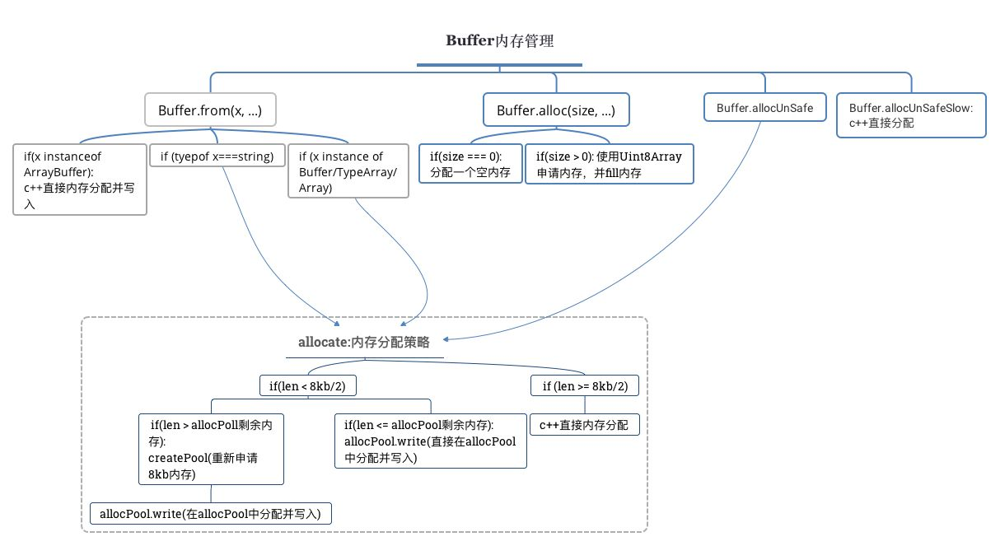

## 初始池
```
//内存分配界限
Buffer.poolSize = 8 * 1024;
var poolSize, poolOffset, allocPool;

------------省略中间代码------------

//初始化池
function createPool() {
  poolSize = Buffer.poolSize;
  allocPool = createUnsafeArrayBuffer(poolSize);
  poolOffset = 0;
}
```

## 分配内存allocate()
```
function allocate(size) {
    if (size <= 0) {
        return new FastBuffer();
    }
    if (size < (Buffer.poolSize >>> 1)) {
        if (size > (poolSize - poolOffset))  createPool();
        var b = new FastBuffer(allocPool, poolOffset, size);
        poolOffset += size;
        alignPool();
        return b;
    } else {
        return createUnsafeBuffer(size);
    }
}

------------省略中间代码------------

function alignPool() {
    // Ensure aligned slices
    if (poolOffset & 0x7) {
        poolOffset |= 0x7;
        poolOffset++;
    }
}
```
这里就是负责分配内存的主要源代码了，
* size <= 0，返回new FastBuffer()

* size < 4 * 1024
    - 如果内存不够调用createPool()初始化；
    - 返回处理后的new FastBuffer()；

* 返回new FastBuffer()

## new FastBuffer() && createUnsafeBuffer(size)
```
//继承自 Uint8Array类
class FastBuffer extends Uint8Array {}
//FastBuffer原型指向 Buffer
FastBuffer.prototype.constructor = Buffer;

internalBuffer.FastBuffer = FastBuffer;

//Buffer原型指向FastBuffer原型
Buffer.prototype = FastBuffer.prototype;

//覆盖属性
for (const [name, method] of Object.entries(internalBuffer.readWrites)) {
  Buffer.prototype[name] = method;
}

------------省略中间代码------------

// |zeroFill| can be undefined when running inside an isolate where we
// do not own the ArrayBuffer allocator.  Zero fill is always on in that case.
const zeroFill = bindingObj.zeroFill || [0];

//入参
function createUnsafeBuffer(size) {
    return new FastBuffer(createUnsafeArrayBuffer(size));
}

function createUnsafeArrayBuffer(size) {
    zeroFill[0] = 0;
    try {
        return new ArrayBuffer(size);
    } finally {
        zeroFill[0] = 1;
    }
}
```

Uint8Array类型数组 表示的8位无符号整数数组。内容被初始化为0。一旦建立，您可以使用对象的方法或使用标准数组索引语法（即使用括号表示法）引用数组中的元素，所以 FastBuffer 其实就是继承自 Uint8Array 和 Buffer的类。

ArrayBuffer 对象表示用于存储不同类型化数组的数据的原始数据缓冲区。无法读取或写入 ArrayBuffer，但可以将它传递给类型化数组或 DataView 对象 来解释原始缓冲区。可以使用 ArrayBuffer 来存储任何类型的数据（或混合类型的数据）。createUnsafeBuffer() 最终也是输出ArrayBuffer参数的FastBuffer实例。


## Buffer.from()
我们先看看这个方法的源码。
```
/**
 * Functionally equivalent to Buffer(arg, encoding) but throws a TypeError
 * if value is a number.
 * Buffer.from(str[, encoding])
 * Buffer.from(array)
 * Buffer.from(buffer)
 * Buffer.from(arrayBuffer[, byteOffset[, length]])
 */
Buffer.from = function from(value, encodingOrOffset, length) {
    if (typeof value === 'string') return fromString(value, encodingOrOffset);

    if (isAnyArrayBuffer(value)) return fromArrayBuffer(value, encodingOrOffset, length);

    if (value === null || value === undefined) {
        throw new ERR_INVALID_ARG_TYPE('first argument', [
            'string', 'Buffer', 'ArrayBuffer', 'Array', 'Array-like Object'
        ], value);
    }

    if (typeof value === 'number') {
        throw new ERR_INVALID_ARG_TYPE('value', 'not number', value);
    }

    const valueOf = value.valueOf && value.valueOf();
    if (valueOf !== null && valueOf !== undefined && valueOf !== value) return Buffer.from(valueOf, encodingOrOffset, length);

    var b = fromObject(value);
    if (b) return b;

    if (typeof value[Symbol.toPrimitive] === 'function') {
        return Buffer.from(value[Symbol.toPrimitive]('string'), encodingOrOffset, length);
    }

    throw new ERR_INVALID_ARG_TYPE('first argument', [
        'string', 'Buffer', 'ArrayBuffer', 'Array', 'Array-like Object'
    ], value);
};
```

### Buffer.from(str[, encoding])
如果是字符串
```
if (typeof value === 'string') return fromString(value, encodingOrOffset);
```
输出方法代码
```
function fromString(string, encoding) {
    var length;
    //针对入参做不同处理
    if (typeof encoding !== 'string' || encoding.length === 0) {
        if (string.length === 0) return new FastBuffer();
        encoding = 'utf8';
        length = byteLengthUtf8(string);//返回一个字符串的实际字节长度
    } else {
        length = byteLength(string, encoding, true);
        if (length === -1) throw new ERR_UNKNOWN_ENCODING(encoding);
        if (string.length === 0) return new FastBuffer();
    }

    //超过Buffer.poolSize限制直接使用C++分配
    if (length >= (Buffer.poolSize >>> 1)) return createFromString(string, encoding);

    //初始池不够用了
    if (length > (poolSize - poolOffset)) createPool();
    var b = new FastBuffer(allocPool, poolOffset, length);
    const actual = b.write(string, encoding);
    if (actual !== length) {
        // byteLength() may overestimate. That's a rare case, though.
        b = new FastBuffer(allocPool, poolOffset, actual);
    }
    poolOffset += actual;
    alignPool();
    return b;
}
```
大概就是参数没问题，小Buffer对象用new FastBuffer分配，大Buffer对象直接C++方法分配


### Buffer.from(arrayBuffer[, byteOffset[, length]])
相关判断代码
```
if (isAnyArrayBuffer(value)) return fromArrayBuffer(value, encodingOrOffset, length);
```
isAnyArrayBuffer(value) 应该是检测类型的方法，源码有个优雅降级的方案。
```
// We cannot use internalBinding unconditionally here because of the way
// that test/parallel/test-buffer-bindingobj-no-zerofill.js is written.
let isAnyArrayBuffer;
try {
    const {internalBinding} = require('internal/bootstrap/loaders');
    isAnyArrayBuffer = internalBinding('types').isAnyArrayBuffer;
} catch (e) {
    isAnyArrayBuffer = require('util').types.isAnyArrayBuffer;
}
```
接下来重点是输出方法
```
function fromArrayBuffer(obj, byteOffset, length) {
    // convert byteOffset to integer，也就是设置byteOffset值
    if (byteOffset === undefined) {
        byteOffset = 0;
    } else {
        byteOffset = + byteOffset;
        if (Number.isNaN(byteOffset)) byteOffset = 0;
    }

    //检测是否超出最大长度
    const maxLength = obj.byteLength - byteOffset;
    if (maxLength < 0)  throw new ERR_BUFFER_OUT_OF_BOUNDS('offset');

    //依旧是对长度做处理
    if (length === undefined) {
        length = maxLength;
    } else {
        // Convert length to non-negative integer.将长度转换为非负整数。
        length = + length;
        if (length > 0) {
            if (length > maxLength)
                throw new ERR_BUFFER_OUT_OF_BOUNDS('length');
            }
        else {
            length = 0;
        }
    }

    return new FastBuffer(obj, byteOffset, length);
}
```
整段代码来看其实也就是做些参数处理，最终返回的还是 FastBuffer类 实例。

### 主代码

我们跳过源码里的判断句直接看逻辑
```
const valueOf = value.valueOf && value.valueOf();
if (valueOf !== null && valueOf !== undefined && valueOf !== value) return Buffer.from(valueOf, encodingOrOffset, length);

var b = fromObject(value);
if (b) return b;
```
valueOf 返回 Array 对象的原始值，然后有值情况下拿原始值重新调用自身。
```
function fromObject(obj) {
    if (isUint8Array(obj)) {
        const b = allocate(obj.length);

        if (b.length === 0) return b;

        _copy(obj, b, 0, 0, obj.length);
        return b;
    }

    if (obj.length !== undefined || isAnyArrayBuffer(obj.buffer)) {
        if (typeof obj.length !== 'number') {
            return new FastBuffer();
        }
        return fromArrayLike(obj);
    }

    if (obj.type === 'Buffer' && Array.isArray(obj.data)) {
        return fromArrayLike(obj.data);
    }
}

------------省略中间代码------------

const {
  copy: _copy,
} = process.binding('buffer');

------------省略中间代码------------

Buffer.prototype.copy =
  function copy(target, targetStart, sourceStart, sourceEnd) {
    return _copy(this, target, targetStart, sourceStart, sourceEnd);
  };
```
只看这段也知道_copy是做到复制写入的作用。
后面的代码根据不同情况也就输出new FastBuffer() 和 fromArrayLike() 两种，FastBuffer类已经知道了，我们直接看fromArrayLike() 的源码。
```
function fromArrayLike(obj) {
    const length = obj.length;
    const b = allocate(length);
    for (var i = 0; i < length; i++)  b[i] = obj[i];
    return b;
}
```
所以 fromArrayLike 内部也是调用 allocate()。


## Buffer.alloc()
我们看看这个方法的源码。
```
/**
 * Creates a new filled Buffer instance.
 * alloc(size[, fill[, encoding]])
 */
Buffer.alloc = function alloc(size, fill, encoding) {
  assertSize(size);
  if (fill !== undefined && size > 0) {
    //上面说过，createUnsafeBuffer(size)最终也是输出ArrayBuffer参数的FastBuffer实例。
    //而_fill会做它做些处理
    return _fill(createUnsafeBuffer(size), fill, encoding);
  }
  return new FastBuffer(size);
};
```
先看看 assertSize() 方法。
```
// The 'assertSize' method will remove itself from the callstack when an error
// occurs. This is done simply to keep the internal details of the
// implementation from bleeding out to users.
function assertSize(size) {
    let err = null;

    if (typeof size !== 'number') {
        err = new ERR_INVALID_ARG_TYPE('size', 'number', size);
    } else if (size < 0 || size > kMaxLength) {
        err = new ERR_INVALID_OPT_VALUE.RangeError('size', size);
    }

    if (err !== null) {
        Error.captureStackTrace(err, assertSize);
        throw err;
    }
}
```
都是些容错代码，忽略。
```
function _fill(buf, val, start, end, encoding) {
    if (typeof val === 'string') {
        //设置写入位置
        if (start === undefined || typeof start === 'string') {
            encoding = start;
            start = 0;
            end = buf.length;
        } else if (typeof end === 'string') {
            encoding = end;
            end = buf.length;
        }

        //获取支持编码
        const normalizedEncoding = normalizeEncoding(encoding);
        if (normalizedEncoding === undefined) {
            if (typeof encoding !== 'string') {
                throw new ERR_INVALID_ARG_TYPE('encoding', 'string', encoding);
            }
            throw new ERR_UNKNOWN_ENCODING(encoding);
        }

        //处理值
        if (val.length === 0) {
            // If val === '' default to zero.
            val = 0;
        } else if (val.length === 1) {
            // Fast path: If `val` fits into a single byte, use that numeric value.
            if (normalizedEncoding === 'utf8') {
                const code = val.charCodeAt(0);
                if (code < 128) {
                    val = code;
                }
            } else if (normalizedEncoding === 'latin1') {
                val = val.charCodeAt(0);
            }
        }
    } else {
        encoding = undefined;
    }

    if (start === undefined) {
        start = 0;
        end = buf.length;
    } else {
        // Invalid ranges are not set to a default, so can range check early.
        if (end === undefined) {
            if (start < 0)  throw new ERR_INDEX_OUT_OF_RANGE();
            end = buf.length;
        } else {
            if (start < 0 || end > buf.length || end < 0)  throw new ERR_INDEX_OUT_OF_RANGE();
            end = end >>> 0;
        }
        start = start >>> 0;
        if (start >= end) return buf;
    }

    const res = bindingFill(buf, val, start, end, encoding);
    if (res < 0) {
        if (res === -1)  throw new ERR_INVALID_ARG_VALUE('value', val);
        throw new ERR_INDEX_OUT_OF_RANGE();
    }

    return buf;
}
```
代码很多，但是只是做些处理判断，然后返回处理后的buf或者报错。


## Buffer.allocUnsafe()
```
/**
 * Equivalent to Buffer(num), by default creates a non-zero-filled Buffer
 * instance. If `--zero-fill-buffers` is set, will zero-fill the buffer.
 */
Buffer.allocUnsafe = function allocUnsafe(size) {
  assertSize(size);
  return allocate(size);
};
```
相当于Buffer(num)，默认情况下创建一个非零填充的缓冲区，返回allocate(size)。


## Buffer.allocUnsafeSlow()
```
Buffer.allocUnsafeSlow = function allocUnsafeSlow(size) {
    assertSize(size);
    return createUnsafeBuffer(size);
};
```
最终也是输出ArrayBuffer参数的FastBuffer实例。
